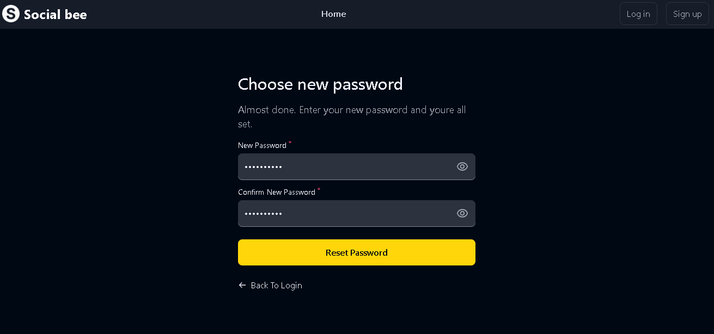

# Social Bee

## Description
This social media app allows users to sign up, log in, reset their password, update password and verify their email. It also includes a post list page with infinite scroll functionality and gets data using a third-party API.

## How to Run Locally
1. Clone the repository: `git clone https://github.com/uday-biswas/social-bee.git`
2. Open the terminal inside the main folder and run these commands to install dependencies:
```
npm install
cd frontend
npm install
cd ../backend
npm install 
cd ..
```
3. Create a `.env` file inside the frontend folder and define the backend url:
```
REACT_APP_BASE_URL=http://localhost:4000/api/v1
```
4. Then create a `.env` file inside the backend folder and define the following:
```
PORT_BACKEND=4000
FRONTEND_URL='http://localhost:3000'

DATABASE_URL= YOUR_MONGODB_URL

JWT_SECRET= RANDOM_SECRET_STRING

CLOUD_NAME= YOUR_CLOUDINARY_CLOUD_NAME
CLOUD_API_KEY= YOUR_CLOUDINARY_API_KEY
CLOUD_API_SECRET= YOUR_CLOUDINARY_API_SECRET
FOLDER_NAME='socialBee'

MAIL_HOST='smtp.gmail.com'
MAIL_USER= YOUR_MAIL_ID
MAIL_PASSWORD= YOUR_MAIL_PASSWORD

```
4. Start the frontend as well as backend with a single command : 
```
npm run dev
```

## or

   firstly, start the backend with the following commands: 
```
cd backend
npm run server
```
   and open another terminal and start the frontend with the following commands : 
```
cd frontend
npm start
```
5. Open your browser and navigate to `http://localhost:3000`

## Landing Page:


## Features
- **Sign Up page:** Users can create a new account by providing their name, email, and password.

- **Email Verification:** Users are required to verify their email address before signup.
- **Sending OTP Email:** Users receive an OTP (One-Time Password) email for additional security.
- **Send OTP page:** Users enter the otp that was sent to their email. 

- **Log In page:** Existing users can log in using their email and password.

- **Forgot Password page:** Users can request a password reset email if they forget their password.

- **Reset Password page:** Users can reset their password by clicking on the link sent to their email.

- **Post List Page:** Displays a list of posts with infinite scroll functionality.


- **Homepage:** Provides an overview of the app and its features.
- **Settings page:** Users can update the profile picture and update their old password.


## Technologies Used
- React.js for the frontend
- Node.js and Express.js for the backend
- MongoDB for the database
- JWT (JSON Web Tokens) for authentication
- Nodemailer for sending emails
- dev.to API for fetching posts with infinite scroll and rate limiting

## Deployment

- The frontend is deployed in vercel. [Link](https://weather-app-loco.vercel.app/) :point_left:
- The backend is deployed in render. [Link](https://weather-app-gar8.onrender.com) :point_left:

## Getting Started
- Follow the live demo links above and enjoy the site.

### Prerequisites

- A modern browser, up to date.  :muscle:

## Author

👤 Uday Biswas
- Github: [@UdayBiswas](https://github.com/uday-biswas) 
- Linkedin: [@UdayBiswas](https://www.linkedin.com/in/udaybiswas944/)  

## Show your support

Give a ⭐️ if you like this project!
